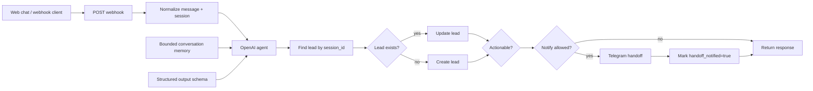

# AI Real Estate Lead Assistant

A deployed AI lead-qualification workflow for real-estate inquiries, built with **n8n, OpenAI, Supabase, webhooks, and Telegram notifications**.

This repository is a **sanitized technical case study** of a live/demo system. Provider credentials, account identifiers, chat IDs, and client-specific data are intentionally excluded.

## What the system does

The agent handles inbound property inquiries, extracts structured lead data, looks up an existing lead by session ID, creates or updates the record in Supabase, evaluates whether the conversation is actionable, and conditionally notifies a human agent.

Typical flow:

## Structured output and validation

The LLM is not allowed to return arbitrary free-form action data. Its output is constrained by a JSON Schema that:

- requires every expected property,
- validates primitive types,
- rejects additional properties,
- separates visitor-facing text from internal lead/action fields.

After parsing, the workflow applies additional business-level validation before any side effect. Examples include strict boolean checks for `lead_ready`, `viewing_intent`, and `handoff`, plus an existing-lead lookup before create/update.

This is stronger than simply checking whether a response happens to be valid JSON, although this version does **not** yet add a separate Zod/Pydantic validation layer outside n8n.

## Action execution model

The model does **not** receive database, Telegram, or provider credentials and cannot execute arbitrary server tools directly.

Instead, it emits constrained state such as:

- `lead_ready`
- `viewing_intent`
- `handoff`
- structured lead fields

The workflow owns the action policy and decides whether a database write or notification is allowed. Service credentials remain server-side in n8n.

### Duplicate side-effect protection

Before sending a sales notification, the workflow checks that the lead is actionable and that `handoff_notified` is not already true. After a successful notification it updates the lead record and sets `handoff_notified=true`.

This is a practical workflow-level duplicate guard. It is **not claimed to be transactionally idempotent** under concurrent requests; a production-hardening step would use a database uniqueness/idempotency key or atomic transaction.

## Conversation memory

Short-term agent context uses a bounded n8n conversation-memory window keyed by the session. Structured lead state is persisted in Supabase independently of the prompt context.

The database can retain conversation history for audit/follow-up, but the full stored transcript is not intended to be appended to the model prompt indefinitely.

## Authentication and authorization

This demo is designed for anonymous inbound website leads, so the visitor is not an authenticated account user.

That means the workflow intentionally exposes only a narrow anonymous capability: submit a message and create/update a lead record. Privileged credentials stay server-side, and the LLM cannot choose arbitrary tables, recipients, or credential scopes.

For an authenticated production product, I would add application-level identity, tenant scoping/RBAC, and server-side authorization checks before privileged actions.

## Reliability and monitoring

Current implementation:

- n8n execution history/logs for workflow debugging
- provider-side API usage visibility
- deterministic branching for downstream actions
- server-side credential storage

Not yet implemented in this demo:

- multi-provider automatic failover
- application-level exponential retry policy
- per-tenant token/cost accounting
- distributed tracing
- database-enforced idempotency

Those are explicit production-hardening items rather than features I claim are already present.

## Stack

- n8n
- OpenAI chat model integration
- Supabase
- Webhooks / HTTP
- Telegram notification action
- Custom web UI

## Repository contents

- `workflow/atlas-property-ai-lead-assistant-en.json` — sanitized n8n workflow export
- `demo/index.html` — English live-demo frontend
- `setup/supabase.sql` — database schema
- `ARCHITECTURE.md` — design notes, trust boundaries, and production-hardening considerations
- `ruflo/` — optional multi-agent development/orchestration setup

## Scope note

This system has been deployed and tested end-to-end as a live/demo workflow, but it has not been operated at large production scale. The repository is intentionally explicit about that boundary.
